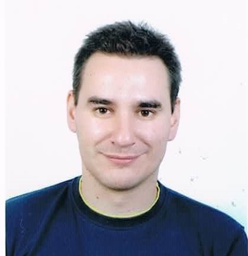

<!DOCTYPE html>
<html lang="pt">
<head>
    <meta charset="UTF-8">
    <meta name="viewport" content="width=device-width, initial-scale=1.0">
    <title>Homepage – Rogerio Campos-Rebelo</title>
    <link rel="stylesheet" href="style.css">
</head>

<body>

<!-- MENU SUPERIOR -->
<nav class="top-menu">
    <ul>
        <li><a href="index.html">Bio</a></li>
        <li><a href="#interesses">Research Interests</a></li>
        <li><a href="publications.html">Publicações</a></li>
        <li><a href="#contactos">Contactos</a></li>
    </ul>
</nav>

<!-- CONTAINER PRINCIPAL -->

    <!-- COLUNA ESQUERDA -->
    <aside class="col esquerda">
        

        <h2>Rogerio Campos-Rebelo</h2>
        <h4>Professor Adjunto / Assistant Professor</h4>
		<h3>ISEL - Instituto Superior de Engenharia de Lisboa</h3>

        

            
<strong>Email:</strong> <a href="mailto:rogeriorebelo@isel.pt">rogeriorebelo@isel.pt</a>

            
<strong>LinkedIn:</strong> <a href="#">linkedin.com/in/teu-perfil</a>

            
<strong>GitHub:</strong> <a href="#">github.com/teuusername</a>

		

	

    <a href="mailto:rogeriorebelo@isel.pt" class="social-icon">
        <!-- Email -->
        <svg viewBox="0 0 24 24">
            <path d="M12 13 0 6V4l12 7 12-7v2l-12 7zm12-9H0v16h24V4z"/>
        </svg>
    </a>

    <a href="linkedin.com/in/teu-perfil" target="_blank" class="social-icon">
        <!-- LinkedIn -->
        <svg viewBox="0 0 24 24">
            <path d="M4.98 3.5C4.98 4.88 3.86 6 2.5 6S0 4.88 0 3.5 1.12 1 2.5 1s2.48 1.12 2.48 2.5zM.5 8h4V24h-4V8zm7.5 0h3.8v2.2h.1c.5-1 1.8-2.2 3.9-2.2 4.2 0 5 2.8 5 6.4V24h-4v-7.8c0-1.9 0-4.3-2.6-4.3-2.6 0-3 2-3 4.1V24h-4V8z"/>
        </svg>
    </a>

	<a href="https://ieeexplore.ieee.org/" target="_blank" class="social-icon">
    <svg viewBox="0 0 64 64">
        <g fill="#4b5563">
            <!-- Losango exterior -->
            <path d="M32 4 L60 32 L32 60 L4 32 Z"/>

            <!-- Bússola interior -->
            <circle cx="32" cy="32" r="10" fill="none" stroke="#4b5563" stroke-width="3"/>
            <path d="M32 22 L35 32 L32 42 L29 32 Z" />
        </g>
    </svg>
</a>

	<a href="https://scholar.google.com/" target="_blank" class="social-icon">
    <svg viewBox="0 0 64 64">
        <g fill="#4b5563">
            <!-- Chapéu académico -->
            <path d="M32 8L4 20l28 12 28-12L32 8zm0 18L10 20v10c0 8 10 16 22 16s22-8 22-16V20L32 26z"/>
            <!-- Borla -->
            <path d="M48 34a4 4 0 1 1-8 0 4 4 0 0 1 8 0z"/>
        </g>
    </svg>
</a>

    <a href="https://github.com/teuusername" target="_blank" class="social-icon">
        <!-- GitHub -->
        <svg viewBox="0 0 24 24">
            <path d="M12 .5C5.73.5.5 5.73.5 12c0 5.1 3.29 9.43 7.86 10.96.58.1.79-.25.79-.56v-2c-3.2.7-3.87-1.54-3.87-1.54-.53-1.34-1.3-1.7-1.3-1.7-1.06-.72.08-.71.08-.71 1.17.08 1.78 1.2 1.78 1.2 1.04 1.78 2.73 1.27 3.4.97.1-.76.41-1.27.74-1.56-2.55-.29-5.23-1.28-5.23-5.7 0-1.26.45-2.3 1.2-3.11-.12-.3-.52-1.52.11-3.17 0 0 .97-.31 3.18 1.19a10.9 10.9 0 0 1 5.8 0c2.2-1.5 3.17-1.19 3.17-1.19.63 1.65.23 2.87.11 3.17.75.81 1.2 1.85 1.2 3.11 0 4.43-2.69 5.41-5.25 5.69.42.36.8 1.1.8 2.22v3.29c0 .31.21.67.8.56A10.99 10.99 0 0 0 23.5 12C23.5 5.73 18.27.5 12 .5z"/>
        </svg>
    </a>

	
<h2></h2>

    </aside>

    <!-- COLUNA CENTRAL -->
    <main class="col centro">
        <section id="bio">
            <h2>Short Bio</h2>
            

                Rogério Campos-Rebelo obteve o mestrado em Engenharia Eletrotécnica e Computadores em 2010, pela Faculdade de Ciências e Tecnologia da Universidade Nova de Lisboa e o Doutoramento em Engenharia Eletrotécnica e Computadores, especialidade em sistemas Computacionais e Percepcionais em 2016 pela Faculdade de Ciências e Tecnologia da Universidade Nova de Lisboa.

Rogério Campos-Rebelo é professor Adjunto no Instituto Superior de Engenharia de Lisboa (ISEL), onde lecciona e desenvolve investigação nas áreas de sistemas embebidos, arquiteturas IoT, sistemas digitais e tecnologias para Smart Cities. Possui experiência tanto na academia como na indústria, tendo contribuído anteriormente para a criação e desenvolvimento do departamento de engenharia dos CTT, onde coordenou projetos de inovação em logística, automação e sistemas conectados. Antes disso, integrou a equipa de investigação da UNINOVA, participando em iniciativas europeias de grande escala, como o projeto Arrowhead.

O seu trabalho atual centra se na engenharia dirigida por modelos para IoT, na modelação de sistemas baseada em ontologias e no desenvolvimento de ferramentas e plataformas de hardware que suportam interoperabilidade, automação e validação de ambientes ricos em sensores. Está igualmente envolvido no desenvolvimento curricular, inovação pedagógica e projetos colaborativos que aproximam a academia, a indústria e instituições públicas.
            

			<h2></h2>
			

                Rogério Campos-Rebelo obtained his Master’s degree in Electrical and Computer Engineering in 2010 from the Faculty of Science and Technology of NOVA University Lisbon, and his PhD in Electrical and Computer Engineering, with a specialization in Computational and Perceptual Systems, in 2016 from the Faculty of Science and Technology of NOVA University Lisbon.

Rogério Campos-Rebelo is a professor at Instituto Superior de Engenharia de Lisboa (ISEL), where he teaches and conducts research in embedded systems, IoT architectures, digital systems, and smart city technologies. He has experience in both academia and industry, having previously contributed to the creation and development of the engineering department at CTT, where he coordinated innovation projects in logistics, automation, and connected systems. Before that, he was part of the UNINOVA research team working on large scale European initiatives such as Arrowhead.

His current work focuses on model driven engineering for IoT, ontology based system modeling, and the development of tools and hardware platforms that support interoperability, automation, and validation of sensor rich environments. He is also actively involved in curriculum development, pedagogical innovation, and collaborative projects that bridge academia, industry, and public institutions.
            

        </section>

        <section id="interesses">
            <h2>Research Interests</h2>
			<!--
Embedded Systems,
			Cyber-Physical Systems,
			Signal Analysis,
			Event-Driven architectures,
			Human-system interaction,
			Petri Nets,
			Model Based Development,
			Hardware/Software Co-Design,
			Reconfigurable Computing Platforms,
			Internet of Things(IoT),
			Semantic Translation,
			Artificial intelligence.
-->
            <ul>
                <li>Embedded Systems</li>
                <li>Cyber-Physical Systems</li>
                <li>Signal Analysis</li>
                <li>Event-Driven architectures</li>
                <li>Human-system interaction</li>
                <li>Petri Nets</li>
                <li>Model Based Development</li>
                <li>Hardware/Software Co-Design</li>
                <li>Reconfigurable Computing Platforms</li>
                <li>Internet of Things(IoT)</li>
                <li>Semantic Translation</li>
                <li>Artificial intelligence</li>
            </ul>
        </section>
    </main>

    <!-- COLUNA DIREITA -->
    <aside class="col direita">

<section id="publicacoes">
            <h2>Links</h2>				
			
			

			

					
			

			

			

			

			

        </section>
<h2></h2>
		
    </aside>

</body>
</html>
